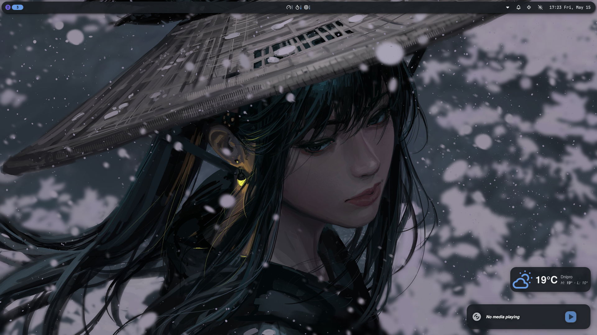
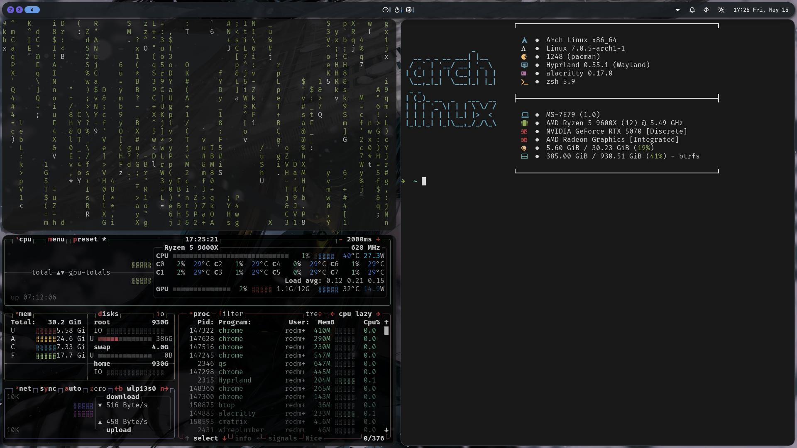

# dots

Arch Linux rice: **Hyprland + Noctalia Shell + fish + alacritty/kitty**, NVIDIA (open-dkms), pipewire, btrfs + timeshift.




The repo mirrors `~/.config` (plus `Wallpapers/` → `~/Pictures/Wallpapers`) and ships an installer that rebuilds the whole system from scratch with a single command.

## Contents

| Directory | What it is |
|---|---|
| `hypr/` | Hyprland configured in **Lua** (`hyprland.lua` + `config/*.lua`), hypridle/hyprlock/hyprpaper, wallpaper and voxtype-toggle scripts |
| `noctalia/` | Noctalia Shell (quickshell): settings, colors, plugins |
| `fish/` | fish + Tide prompt (fully vendored, no fisher needed) |
| `alacritty/`, `kitty/` | terminals + theme collections |
| `fastfetch/`, `solaar/`, `voxtype/` | fetch config, Logitech devices, voice typing |
| `Wallpapers/` | wallpapers (deployed to `~/Pictures/Wallpapers`) |
| `packages.json` | manifest: packages, services, groups, deploy rules — everything the installer is driven by |
| `install.py` / `install.sh` | installer and curl bootstrap |
| `system/` | system-level files (`zram-generator.conf` → `/etc/systemd/`) |

## Installing on bare Arch

Requirements: fresh Arch install, a user with sudo, network access. Then one command:

```sh
curl -fsSL https://raw.githubusercontent.com/redmoondz/dots/master/install.sh | bash
```

The bootstrap installs `git` and `python` if missing, clones the repo to `~/Documents/dots` and runs `install.py`. Flags pass through via `bash -s --`:

```sh
# preview every action without changing anything
curl -fsSL https://raw.githubusercontent.com/redmoondz/dots/master/install.sh | bash -s -- --dry-run

# fully unattended (every prompt takes its default)
curl -fsSL https://raw.githubusercontent.com/redmoondz/dots/master/install.sh | bash -s -- --noconfirm
```

If the repo is already cloned, run the installer directly:

```sh
python3 ~/Documents/dots/install.py install [flags]
```

### What the installer does (step by step)

Every step is **idempotent** — the script is safe to re-run: already-done work prints as `skip`, changes as `ok`. The sudo password is asked once (kept alive for the whole run).

1. **preflight** — sanity checks: Arch, not root, sudo, network
2. **multilib** — enables `[multilib]` in pacman.conf (steam/wine/lib32)
3. **update** — `pacman -Syu` (partial upgrades are dangerous on Arch)
4. **git-config** — user.name/user.email (prompt with defaults)
5. **yay** — builds yay from AUR via makepkg
6. **native / aur / npm / curl-tools** — every package from `packages.json`: official repos, AUR (voxtype, noctalia-git, chrome, spotify…), `@openai/codex`, the claude-code and codex CLIs
7. **deploy** — configs as **symlinks**: `~/.config/hypr → ~/Documents/dots/hypr` etc. The repo becomes the single source of truth — config edits show up in `git diff` immediately. Existing directories are backed up as `*.bak-<date>`. Alternative: `--mode=copy`
8. **system-files** — `system/zram-generator.conf` → `/etc/systemd/`
9. **shell / path / groups** — fish into `/etc/shells` + `chsh`, `~/.local/bin` on PATH, `input` group (needed by voxtype)
10. **services** — NetworkManager, bluetooth, cronie, timesyncd. Docker gets installed but its service is **not** enabled. `voxtype.service` is force-disabled — Hyprland launches voxtype via `exec-once`, running both crash-loops
11. **display-manager** — **SDDM** by default (`--dm gdm|greetd|tty|skip`). An already-enabled DM is never touched without `--force-dm`
12. **nvidia-check** — verifies dkms built the nvidia modules (warns only, never auto-fixes)
13. **voxtype** — downloads the `large-v3` whisper model (~3 GB, asks first; `--skip-model` to defer), `--voxtype-gpu` for GPU inference
14. Final **checklist** of manual follow-ups

### Flags

| Flag | Meaning |
|---|---|
| `--dry-run` | print actions without executing anything |
| `--noconfirm` | no questions, take defaults |
| `--mode symlink\|copy` | config deploy strategy (default: symlink) |
| `--dm sddm\|gdm\|greetd\|tty\|skip` | display manager (default: sddm) |
| `--force-dm` | replace an already-enabled DM |
| `--skip-update / -native / -aur / -npm / -curl / -deploy / -services / -model` | skip a phase |
| `--with-optional` | also install `optional[]` packages (loupe, papers, hyprpolkitagent…) |
| `--with-zsh` | also deploy the legacy `.zshrc` |
| `--voxtype-gpu` | run `voxtype setup gpu --enable` |
| `--git-name / --git-email` | git identity without a prompt |
| `--only step1,step2` | run only the listed steps (names: `--list-steps`) |

Examples:

```sh
python3 install.py install --only deploy          # just recreate the symlinks
python3 install.py install --dm=greetd --force-dm # switch the DM to greetd
python3 install.py install --skip-aur --skip-model --noconfirm
```

## Maintenance

```sh
python3 install.py sync     # package lists -> packages.json
python3 install.py check    # verify every package name still resolves in repos/AUR
```

- **`sync`** regenerates `packages.json` from `pacman -Qqen/-Qqem` using the `sync_policy` rules: the GNOME stack is excluded, pins (pipewire, portals, lib32-nvidia-utils, virtualbox-host-dkms…) are preserved, and packages from `removed_do_not_install` never come back. It also mirrors live configs into the repo if they are not symlinks yet. It never commits — it only shows `git status`.
- **`check`** runs `pacman -Si` / `yay -Si` over every name — catches packages migrating between AUR and the official repos. Run it before restoring onto a new machine.

Installed a new package → `python3 install.py sync` → `git add -A && git commit && git push`. Changed a config → it's already in the repo (symlinks) → just commit.

## Design decisions

- **GNOME is excluded.** The source machine has GNOME installed alongside, but the restore doesn't pull it in: gdm/gnome-shell and the whole stack live in `sync_policy.exclude_globs`. Exceptions: `gnome-keyring` (secrets under Hyprland) and former GNOME dependencies promoted to explicit packages (pipewire, bluez, libnotify, noto-fonts, polkit, xdg-desktop-portal-hyprland/-gtk).
- **The source of truth is pacman, not bash_history.** Shell history is full of typos and reverted installs; the manifest is generated from `pacman -Qqen/-Qqem` and kept fresh by `sync`.
- **`removed_do_not_install`**: epiphany, noctalia-qs (replaced by noctalia-git), datagrip, google-chrome-bin, voxtype-cuda — installed once and deliberately removed; the installer will never bring them back.
- **Provider pins**: `lib32-nvidia-utils` and `virtualbox-host-dkms` are listed explicitly, otherwise `--noconfirm` would pick lib32-mesa / virtualbox-host-modules-arch.

## Post-install checklist (also printed by the script)

- Re-login/reboot — `input` group, login shell, NVIDIA driver
- Log into `claude` and `codex`
- `nvidia-smi` — verify the driver after reboot
- Configure timeshift snapshots
- voxtype: **SCROLLLOCK** hotkey (push-to-talk); daemon toggle — `SUPER+ALT+R`

## Known limitations

- Bootstrapping yay from scratch, the first SDDM enable, the first dkms build and `chsh` have not been exercised on a real bare machine — only in idempotent mode on the configured system. Watch the step output on the first real restore.
- The whisper model (~3 GB) is not in the repo and is downloaded separately; voxtype does not work without it.
- Logins for claude/codex/chrome/spotify and other accounts are not automated.
